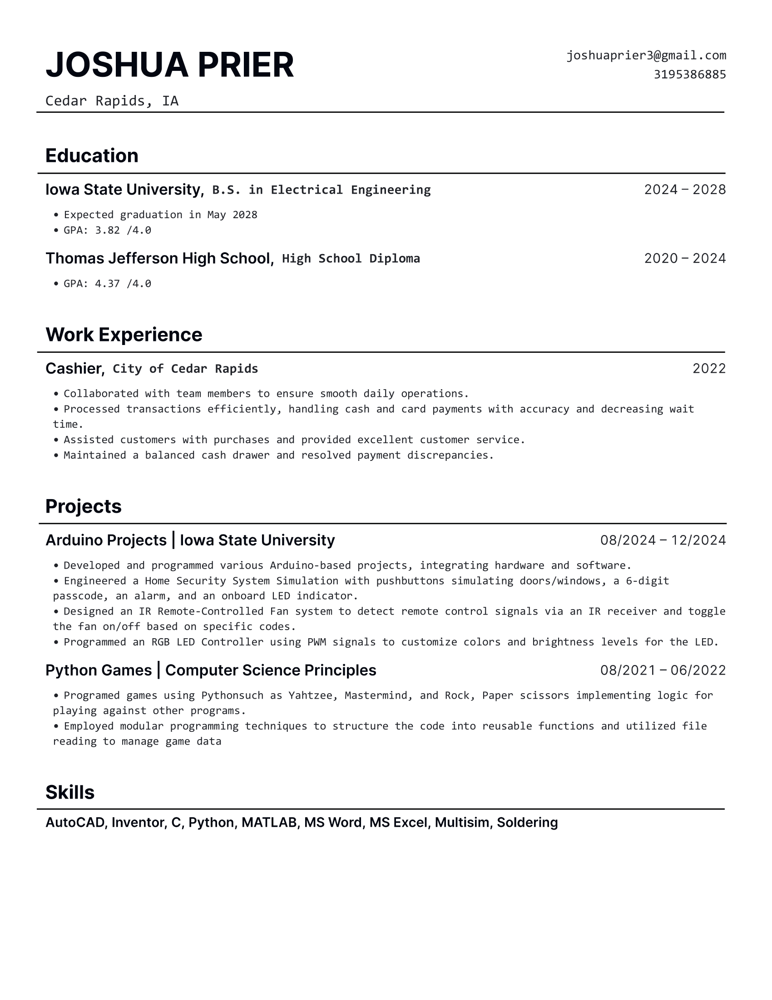

# Joshua Prier

## About Me
I'm an aspiring Electrical Engineer with a passion for hands-on projects and problem-solving. I especially enjoy looking for ways to expand my skills. With a strong analytical mindset and a drive to learn, I'm eager to apply my knowledge to real-world applications.

## Resume

## Projects

### RGB LED Controller

